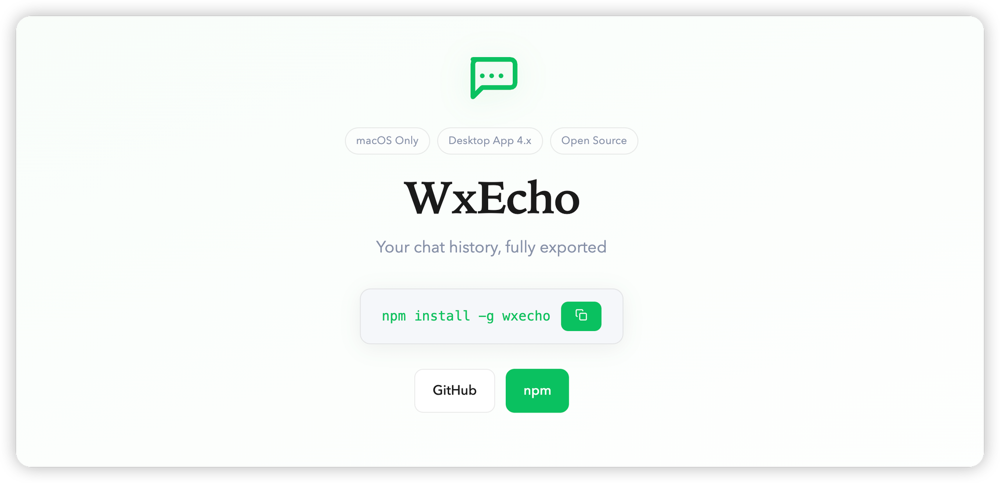

<div align="center">

# WxEcho

**macOS 原生聊天记录导出工具**

[English](./README_en.md) · [中文](./README_zh.md)

---

<p align="center">
  
</p>

<p align="center">
  
  
  
  
  
</p>

> ⚠️ **免责声明**: 本工具仅供个人备份和教育学习使用。使用本工具可能违反相关平台的 服务条款。对于因使用本工具导致的账号封禁、数据丢失或法律后果，作者不承担任何责任。使用前请自行评估风险。

</div>

---

## ✨ 功能特性

<div align="center">

| 功能 | 描述 |
|------|------|
| 🔑 **密钥提取** | 直接从运行进程内存中提取加密密钥 |
| 🔓 **数据库解密** | 解密 SQLCipher 4 (AES-256-CBC) 加密的数据库 |
| 📤 **多格式导出** | 支持导出为 TXT / CSV / JSON 格式 |
| 🔍 **模糊搜索** | 通过昵称或备注搜索联系人 |
| 💬 **群聊支持** | 完整支持群聊会话导出 |
| 🍎 **原生 macOS** | 基于 Mach VM API 构建，支持 Apple Silicon 和 Intel |

</div>

---

## 🚀 快速开始

### 环境要求

<div align="center">

- macOS 11+
- 桌面应用 4.x (已登录，聊天记录已同步)
- Xcode Command Line Tools: `xcode-select --install`
- Python 3.8+: `pip install pycryptodome`

</div>

### 安装

```bash
npm install -g wxecho
```

或手动安装：

```bash
git clone https://github.com/chang-xinhai/WxEcho.git
cd WxEcho
npm install && npm run build
```

### 使用方法

```bash
# 步骤 1: 重新签名应用
sudo codesign --force --deep --sign - /Applications/WeChat.app

# 重新打开并登录

# 步骤 2: 提取密钥
sudo wxecho keys

# 步骤 3: 解密数据库
wxecho decrypt

# 步骤 4: 导出聊天记录
wxecho export -l                    # 列出所有会话
wxecho export -n "张三"            # 按名称导出
```

---

## ⚙️ 工作原理

<div align="center">

```
运行中的应用进程 ──密钥提取──▶ keys.json ──解密──▶ 明文 SQLite ──导出──▶ TXT/CSV/JSON
   (SQLCipher 4)                     (AES-256-CBC)      (.db 文件)       (聊天记录)
```

应用使用 [WCDB](https://github.com/nicklockwood/wcdb)（基于 SQLCipher 4），每个数据库的 AES-256 密钥缓存在进程内存中，存储格式为 `x'<64hex_key><32hex_salt>'`。

</div>

---

## 📋 命令行工具

<div align="center">

| 命令 | 描述 |
|------|------|
| `wxecho keys` | 从运行中的进程提取数据库密钥（需要 sudo） |
| `wxecho decrypt` | 解密本地数据库 |
| `wxecho export [options]` | 导出聊天记录 |
| `wxecho doctor` | 检查环境依赖 |

### export 选项

| 选项 | 描述 |
|------|------|
| `-l, --list` | 列出所有会话 |
| `-n, --name <name>` | 按昵称或备注搜索联系人 |
| `-u, --username <wxid>` | 按精确用户名匹配 |
| `-o, --output <dir>` | 指定输出目录 |
| `--top <n>` | 列出前 N 个会话（默认: 20） |
| `--my-wxid <wxid>` | 自己的用户 ID（省略时自动检测） |

</div>

---

## 📁 数据库结构

<div align="center">

解密后的数据库位于 `py/decrypted/`：

</div>

```
decrypted/
├── contact/contact.db          # 联系人
├── session/session.db          # 会话列表
├── message/message_0.db        # 聊天消息（按时间分片）
├── message/message_fts.db     # 全文搜索索引
├── message/media_0.db         # 语音消息
├── sns/sns.db                  # 朋友圈
├── favorite/favorite.db        # 收藏
└── ...
```

<div align="center">

每个联系人/群聊的消息存储在名为 `Msg_<md5(username)>` 的表中。

</div>

---

## ❓ 常见问题

**Q: `task_for_pid failed` 怎么办？**
请确保：(1) 使用 `sudo` 运行；(2) 应用已重新签名；(3) 应用正在运行且已登录。

**Q: 更新应用后还能用吗？**
更新会恢复原始代码签名，请重新运行签名步骤。

**Q: 为什么有些消息显示 `[Compressed Content]`？**
部分消息使用 zstd 压缩。大多数文本消息不受影响。

**Q: 如何导出图片/视频/音频？**
本工具仅导出文本记录。媒体文件在 `xwechat_files/.../Message/`，可通过 `message_resource.db` 关联。

**Q: 支持群聊吗？**
支持。导出方式相同，每条消息会显示发送者的真实昵称/备注。

---

## 🔗 相关项目

<div align="center">

| 项目 | 描述 |
|------|------|
| [ydotdog/wechat-export-macos](https://github.com/ydotdog/wechat-export-macos) | 原项目 |
| [L1en2407/wechat-decrypt](https://github.com/L1en2407/wechat-decrypt) | C 内存扫描器 |
| [Thearas/wechat-db-decrypt-macos](https://github.com/Thearas/wechat-db-decrypt-macos) | lldb 密钥提取 |
| [ylytdeng/wechat-decrypt](https://github.com/ylytdeng/wechat-decrypt) | 原始内存搜索 |

</div>

---

## 📜 许可证

<div align="center">

MIT License

</div>

---

<p align="center">
  用 ❤️ 制作 by <a href="https://github.com/chang-xinhai">chang-xinhai</a>
</p>